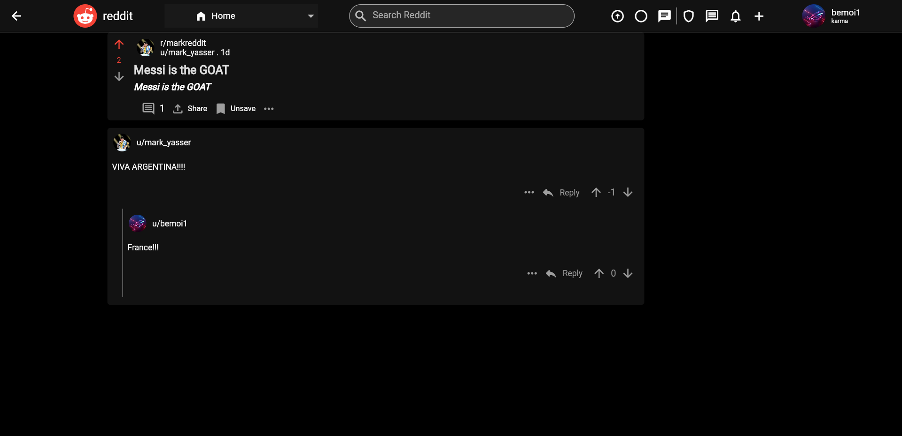
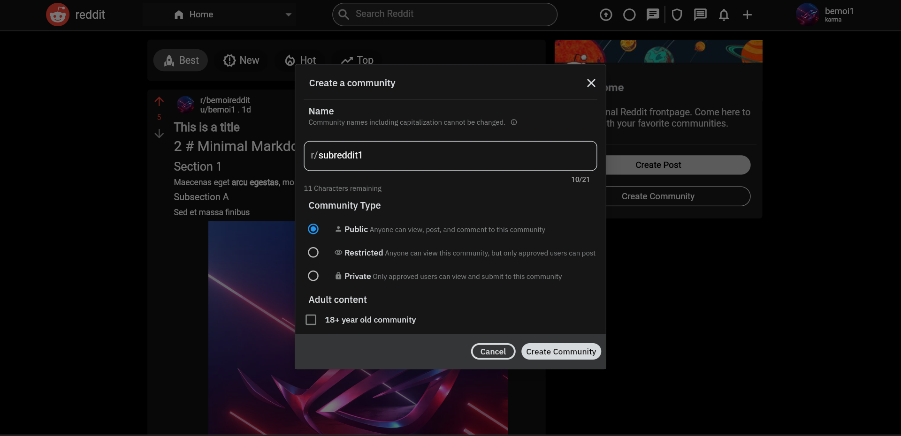
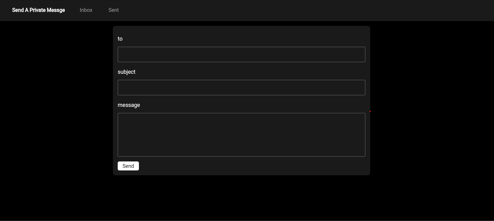

# Cross-Platform

This repository is made for cross-platform subteam which is responsible for developing an Android application and a website as a clone of Reddit.

## Built With

## Features

### Android

### Web

## Team members

- <a href="https://github.com/bemoierian">Bemoi Erian</a>
- <a href="https://github.com/markyasser">Mark Yasser</a>
- <a href="https://github.com/EngPeterAtef">Peter Atef</a>
- <a href="https://github.com/omarkhaled2001">Omar Khaled</a>
- <a href="https://github.com/Rufaida-Kassem">Rufaida Kassem</a>
